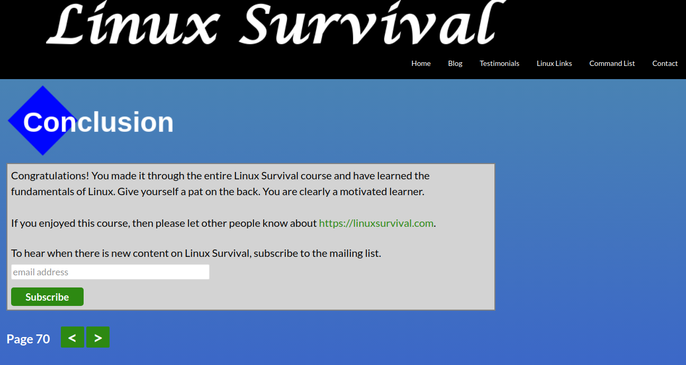
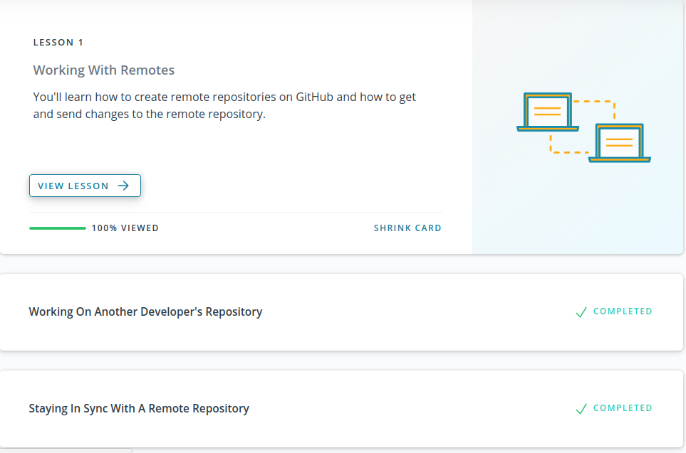

# kottans-frontend

## General
  - [x] [0.Git Basics](https://github.com/kottans/frontend/blob/master/tasks/git-intro.md)
  - [x] [1.Linux CLI and HTTP](https://github.com/kottans/frontend/blob/master/tasks/linux-cli-http.md)
  - [x] [2.VCS (hello gitty), GitHub and Collaboration](https://github.com/kottans/frontend/blob/master/tasks/git-collaboration.md)
 
 ## Front-End Basics
  - [x] [3.Intro to HTML & CSS](https://github.com/kottans/frontend/blob/master/tasks/html-css-intro.md)
  - [x] [4.Responsive Web Design](https://github.com/kottans/frontend/blob/master/tasks/html-css-responsive.md)
  - [ ] 5.HTML & CSS Practice
  - [ ] 6.JavaScript Basics
  - [ ] 7.Document Object Model - practice
  
 ## Advanced Topics
  - [ ] 8.Building a Tiny JS World (pre-OOP) - practice
  - [ ] 9.Object oriented JS - practice
  - [ ] 10.OOP exercise - practice
  - [ ] 11.Offline Web Applications
  - [ ] 12.Memory pair game — real project!
  - [ ] 13.Website Performance Optimization
  - [ ] 14.Friends App - real project!
  
   ## Git Basics
  I was not familiar with Git before, as well as the 
  Frontend in general, so it was interesting experience 
  for me to   get new material on this course. For me there is a lot 
  of new useful information that I will use in practice 
  in the future. Thanks to the Kottans for support 
  and motivation to move on.
  
  

    

     screenshot
    

    
    
    
  

  
  ***
  ## Linux CLI, and HTTP
  In this module, almost everything was new for me, so it was nice to find familiar commands from the previous module.
  It was a great experience,and I will definitely use it in my future work.
  

    

     screenshot
    

    
    
    
    
                     
  

  
  After completing reading articles about HTTP protocols I learned about:

  - HTTP headers, status codes, messages, responses, requests;
  - identification and authentication;
  - HTTPS;
  
    and discovered interesting features like:
    
  - types of headers;
  - using HTTP in web frameworks examples.
  
  ## Git Collaboration  
  A very powerful course! As always, I've learned a lot of new things:
  - how to create pull requests; 
  - work in a local repository with two remote branches (origin and upstream branches);
  - how to squash commits interactively. 
  
  I am sure, all this knowledge will be useful to me in practice in the future.
  

    

     screenshot
    

    
  

  
  _I've already completed all the levels at learngitbranching.js.org during_ [0.Git Basics](#git-basics)

  ## Intro to HTML and CSS
  In this module, all information was new for me. I had to strain a little to comprehend and fix it in my head. I was surprised by flex and grid how powerful tools     they are.
  I think I will use all this knowledge in the future to create beautiful and responsive websites.
  

    

     screenshot
    

    
    
                    
  

  
  ## Responsive Web Design
  With this module I expanded my knowledge of the frontend. As always, all the information in this module was new to me.
  Now I know about:
 - viewport features, responsive markup features;
 - media query features, breakpoints;
 - how to set up a test suite using a combination of physical devices, emulators and simulators;
 - the most popular responsive layout templates and explore the tools needed to implement them in my own projects.

  Thanks to Flexbox Froggy, I've had amazing practice with flexbox.
  

    

     screenshot
    

    
    
  

  
   ## HTML and CSS practice
   This task was new and difficult enough for me. I had to spend a lot of time to figure it out and I did it:). I learned how to make a popup menu without    JavaScript, only on HTML and СSS. It was a great opportunity for me to apply the knowledge I gained about HTML and СSS.
   The link to the result of my work is below.
   
   [Demo](https://alexey1985-fe.github.io/HTML-CSS-Popup/.)
   
   
